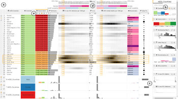

mothertable [![Phovea][phovea-image]][phovea-url] [![NPM version][npm-image]][npm-url] [![Build Status][travis-image]][travis-url] [![Dependency Status][daviddm-image]][daviddm-url]
=====================

Mother Table Project @ JKU

<center>

</center>

## Installation

Preconditions: 
 * Have [git/ssh](https://help.github.com/articles/signing-commits-with-gpg/) set up.
 * Have [Yeoman](http://yeoman.io/) installed.
 * Have [Docker](https://www.docker.com/) installed and running.

### Install with all dependencies

```bash
yo phovea:setup-workspace mothertable_product
```
Next install and run the server via docker: 
```bash
cd mothertable
docker-compose up -d
```
Finally, in a separate console, run the client: 
```bash
npm run start:mothertable
```

### Single Plugin, no dependencies

```bash
git clone https://github.com/Caleydo/mothertable.git
cd mothertable
npm install
```

Testing
-------

```
npm test
```

Building
--------

```
npm run build
```


***

<a href="https://caleydo.org"></a>
This repository is part of **[Phovea](http://phovea.caleydo.org/)**, a platform for developing web-based visualization applications. For tutorials, API docs, and more information about the build and deployment process, see the [documentation page](http://phovea.caleydo.org).


[phovea-image]: https://img.shields.io/badge/Phovea-Application-1BA64E.svg
[phovea-url]: https://phovea.caleydo.org
[npm-image]: https://badge.fury.io/js/mothertable.svg
[npm-url]: https://npmjs.org/package/mothertable
[travis-image]: https://travis-ci.org/Caleydo/mothertable.svg?branch=master
[travis-url]: https://travis-ci.org/Caleydo/mothertable
[daviddm-image]: https://david-dm.org/Caleydo/mothertable/status.svg
[daviddm-url]: https://david-dm.org/Caleydo/mothertable
